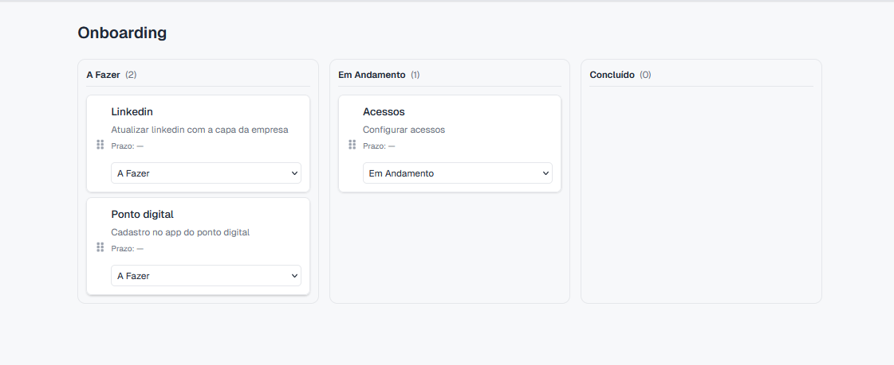
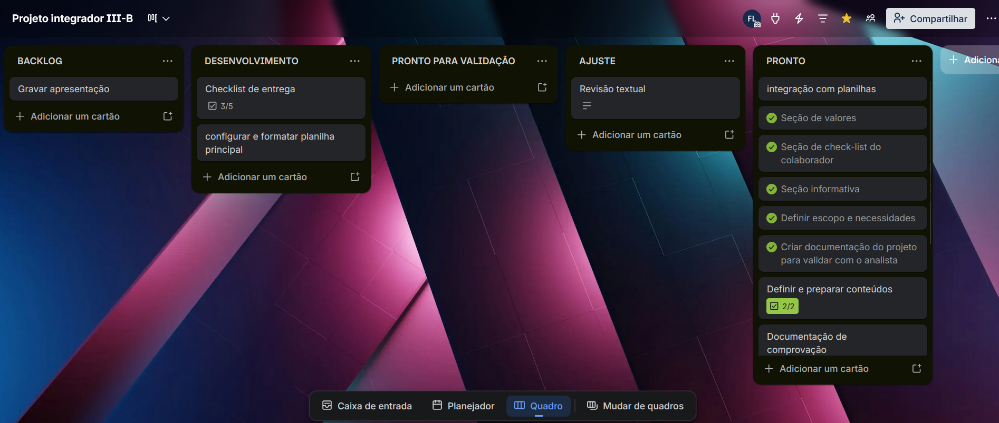
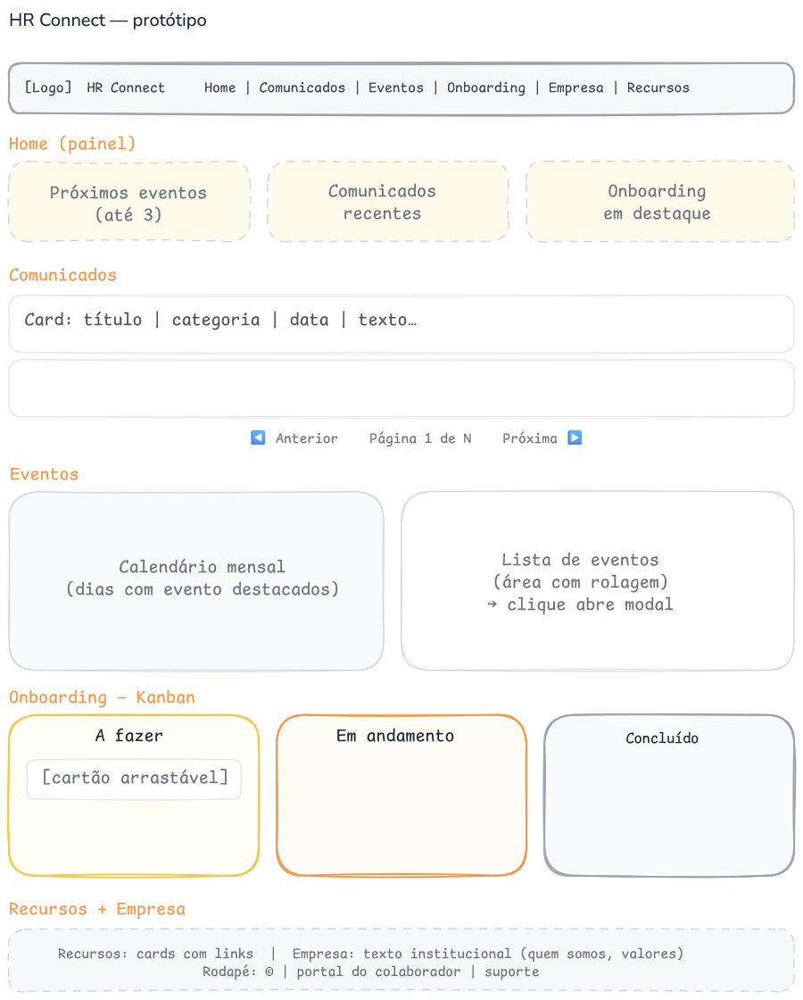

# Documentação do projeto — RH Connect

---

**PONTIFÍCIA UNIVERSIDADE CATÓLICA DE GOIÁS**  
**COORDENAÇÃO ENSINO A DISTÂNCIA – CEAD**  
**ESCOLA POLITÉCNICA E DE ARTES**  
**ANÁLISE E DESENVOLVIMENTO DE SISTEMAS**


---

## Identificação

| Campo | Informação |
|--------|------------|
| **Projeto** | RH Connect — Portal de comunicação e atividades internas |
| **Disciplina** | Projeto Integrador III–B |
| **Curso** | Análise e Desenvolvimento de Sistemas |
| **Integrantes** | Felipe Alves Louzeiro |

---

## Resumo

O **RH Connect** é um portal web voltado aos colaboradores, por meio do qual a área de **Gente e Gestão** centraliza comunicados, eventos, materiais de onboarding e links úteis. O conteúdo é mantido em planilhas, ferramenta já utilizada no cotidiano da equipe, sendo consumida pela aplicação sem necessidade de alteração de código a cada nova publicação. A solução prioriza usabilidade acessível e contempla um quadro Kanban para o onboarding interativo do colaborador, de modo a favorecer a conclusão das etapas e o uso do material de apoio antes do contato com o RH.

---

## 1. Introdução

Em contextos organizacionais, sobretudo em empresas de tecnologia, a comunicação interna deve ser clara, atualizada e facilmente localizável. Quando avisos e normas se dispersam por e-mail, mensagens instantâneas e arquivos soltos, aumenta o risco de informação desatualizada e de retrabalho para o setor responsável pela gestão de pessoas.

O presente trabalho insere-se na extensão universitária e propõe um canal web único de consulta para o colaborador, alinhado às diretrizes do Projeto Integrador e à necessidade de organização e acompanhamento de atividades internas, com integração a fonte externa de dados, visualização em calendário e em quadro Kanban, conforme previsto na metodologia da disciplina.

---

## 2. Problema, importância e justificativa

A área de pessoas precisa divulgar comunicações internas de forma consistente, políticas, eventos, campanhas e orientações de integração. Sem um ponto de convergência, o colaborador perde tempo na busca por informações ou recorre ao RH para dúvidas já contempladas em documentos existentes.

A solução desenvolvida contribui para:

- **Centralizar**, em um único endereço, comunicados, agenda de eventos, onboarding, recursos e conteúdo institucional;
- **Facilitar a atualização** de conteúdo pela equipe de Gente e Gestão, por meio da planilha, reduzindo dependência de outros setores para publicações rotineiras;
- **Manter a interface simples**, de modo que distintos perfis de colaborador consigam utilizar o portal com baixa curva de aprendizado;
- **Apoiar o onboarding** com um **Kanban** (*A fazer*, *Em andamento*, *Concluído*), em que o **acompanhamento individual** do preenchimento não constitui rotina de auditoria do RH, mas a **visualização do status** e a **organização em colunas** incentivam a conclusão do fluxo e a leitura prévia dos materiais, em linha com a autonomia do colaborador e com a redução de demandas repetitivas ao RH.

---

## 3. Objetivos

### 3.1 Objetivo geral

Desenvolver um sistema web funcional que funcione como ferramenta interna de comunicação e apoio ao colaborador, atendendo à demanda extensionista delineada no contexto do projeto.

### 3.2 Objetivos específicos

- Divulgar comunicados institucionais, com leitura organizada e paginação quando a lista for extensa;
- Apresentar eventos em calendário e em lista, permitindo a visualização de prazos e detalhes;
- Disponibilizar onboarding em formato Kanban, com persistência local do status por colaborador;
- Centralizar links e recursos internos;
- Disponibilizar página Empresa com conteúdo institucional estável;
- Aplicar identidade visual coerente com o contexto de uso e redação adequada ao público interno.

---

## 4. Escopo funcional

| Área | Descrição |
|------|-----------|
| **Home** | Painel com resumos: próximos eventos, comunicados recentes e destaques de onboarding. |
| **Comunicados** | Listagem com categorias; 10 itens por página. |
| **Eventos** | Calendário mensal e lista com área de rolagem; detalhes em janela modal. |
| **Onboarding** | Quadro Kanban alimentado por dados externos; estado do quadro armazenado localmente no navegador. |
| **Empresa** | Textos institucionais (*Quem somos*, valores). |
| **Recursos** | Cartões com título, descrição e link. |

---

## 5. Arquitetura e tecnologias

O fluxo de dados pode ser descrito, de forma sintética, como: edição da planilha pela equipe de Gente e Gestão → armazenamento no Google Sheets → exposição em JSON por serviço intermediário (opensheet) → aplicação Next.js que renderiza as páginas ao colaborador.

Foram empregados Next.js (App Router), React, TypeScript e Tailwind CSS.

---

## 6. Gerenciamento interativo

O onboarding apresenta as tarefas definidas pela equipe de Gente e Gestão em três colunas, alinhadas ao modelo Kanban previsto na ementa: **A fazer**, **Em andamento** e **Concluído**. O colaborador pode alterar o status por arrastar cartões ou por seleção no próprio cartão; o estado é mantido no armazenamento local do navegador.

**Figura 1 — Tela do onboarding:**



---

## 7. Gestão do projeto e metodologia

O desenvolvimento foi organizado segundo boas práticas de gerência de projeto, com planejamento de escopo, divisão de atividades e acompanhamento contínuo, utilizando abordagem próxima às metodologias ágeis. O Trello foi empregado para registrar tarefas e evolução do trabalho extensionista, conforme artefato solicitado na disciplina.

**Figura 2 — Quadro de tarefas no Trello:**



**Link do quadro Trello:** [Acessar quadro](https://trello.com/invite/b/69c7fda2dac0bb874c0858e0/ATTIdc945ca253b49a9731e71666432b875e2256F5A9/projeto-integrador-iii-b)

---

## 8. Protótipo de interface

Foi elaborado um diagrama na ferramenta Excalidraw, representando as principais áreas da interface: cabeçalho e navegação, home, comunicados com indicação de paginação, eventos, Kanban de onboarding, recursos e empresa/rodapé.

**Visualização no Excalidraw:** [Abrir diagrama](https://excalidraw.com/#json=uY2brpEpzE_fyenUOshIQ,VAdwt9RiTTBaHphJZ4MJVQ)

**Figura 3 — Protótipo de interface:**



---

## 9. Como executar o projeto

Pré-requisitos: **Node.js 20+** (recomendado).

```bash
npm install
```

Crie o arquivo .env.local na raiz do repositório (vide .env.example):

```env
SPREADSHEET_ID=identificador_da_planilha_google
```

```bash
npm run dev
```

Acesse [http://localhost:3000](http://localhost:3000).

Build de produção:

```bash
npm run build
npm start
```

### Deploy da versão de teste na Vercel

**URL da aplicação (teste):** _[Acessar aplicação](https://rhhub.vercel.app/)_

_Na publicação acadêmica, o SPREADSHEET_ID utilizado aponta para uma planilha de desenvolvimento, não para bases de uso operacional._

---

## 10. Considerações finais

O RH Connect materializa uma resposta extensionista a uma demanda de organização de informações e de atividades voltadas ao colaborador, com sistema web em funcionamento, integração a dados externos, calendário de eventos e quadro Kanban para onboarding. Neste trabalho, o escopo privilegiou o portal de comunicação e o acompanhamento individual das tarefas de integração que eram cruciais as necessidades do departamento, deixando evoluções como login corporativo e painel administrativo dedicado como perspectivas futuras de melhoria.

---

## Natureza do trabalho e colaboração

Este documento integra a documentação acadêmica do Projeto Integrador III–B e complementa o repositório entregue na disciplina. Os dados exibidos na demonstração(comunicados, eventos, atividades de onboarding e demais conteúdos), são **meramente representativos**, com fins ilustrativos, de modo a **preservar a imagem da empresa** e a **não vincular nem expor atividades internas** reais da organização, inclusive no que diz respeito às capturas de tela deste repositório.

---

## Referências

- Documentação do [Next.js](https://nextjs.org/docs).  
- Serviço [opensheet](https://opensheet.elk.sh/) para leitura de planilhas em JSON.  
- [Excalidraw](https://excalidraw.com/) — ferramenta utilizada na elaboração do protótipo de interface.
